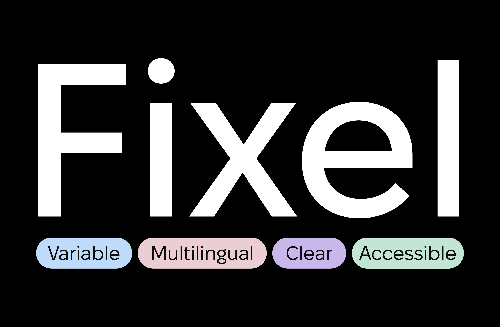
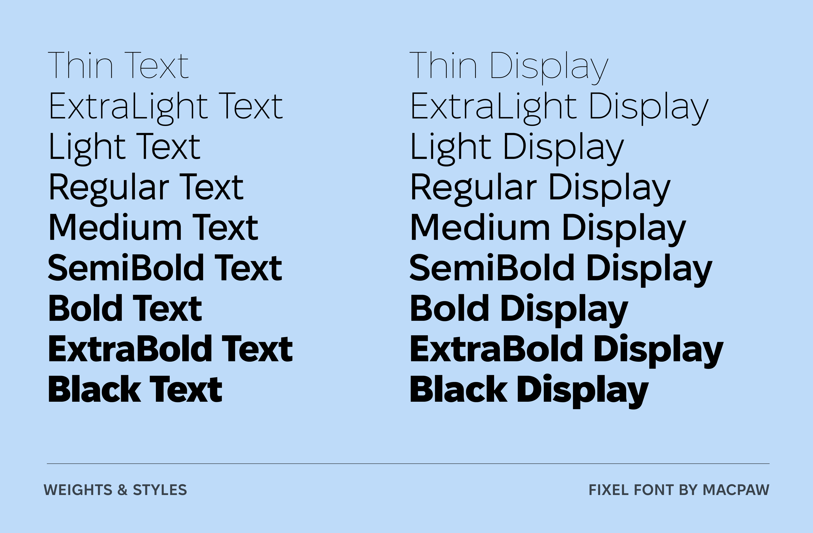
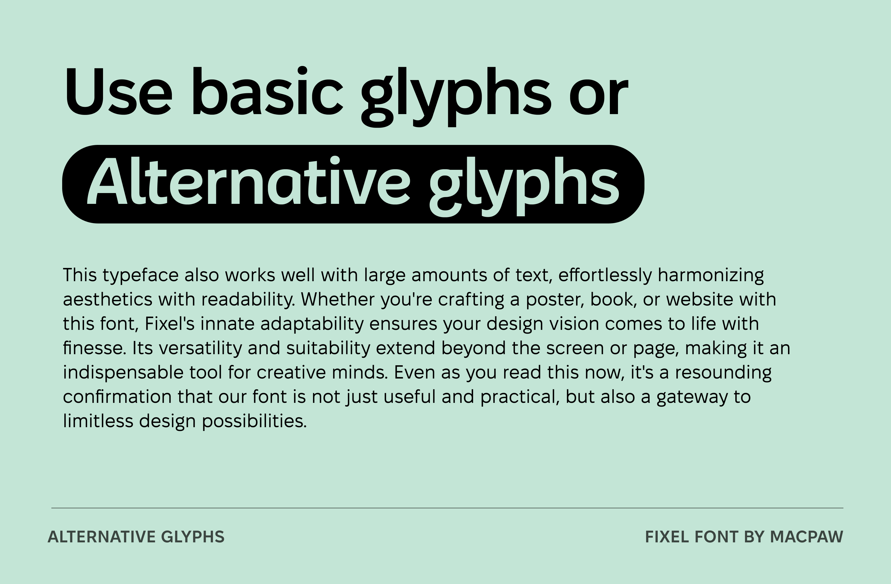
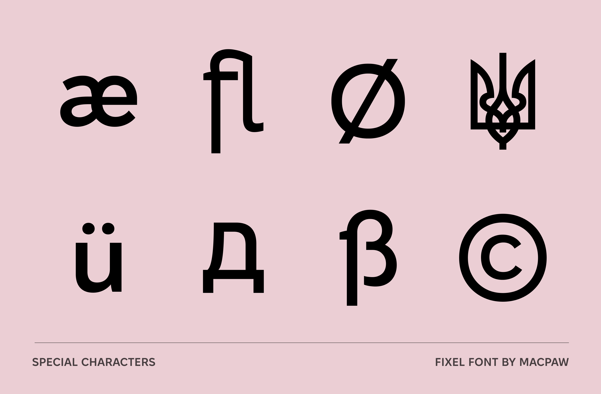
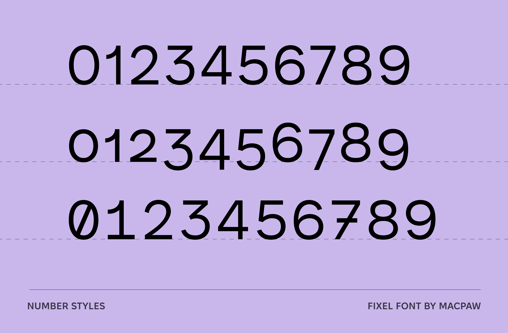

# Fixel

Fixel font public repository.







## About

Fixel is a contemporary sans-serif by MacPaw — a combination of geometric and humanist grotesques, with open letterforms, wide proportions, crisp edges, and low contrast. It is suitable for content from headlines and logos to long passages of text.

- Extended Latin and Cyrillic; 40+ languages
- Two widths: **Display** (`wdth=100`) and **Text** (`wdth=87.5`)
- Nine weights: Thin → Black (`wght=100`–`900`)
- One variable font with `wdth` + `wght` axes
- Alternate symbols, including the «tryzub» after Nil Khasevych (1949)
- Free for commercial and personal use under the SIL Open Font License v1.1

## Repository layout

```
sources/        UFO masters, .designspace and gftools-builder config
fonts/          Build output: variable, static TTF, and webfonts (WOFF2)
documentation/  DESCRIPTION.en_us.html and images
```

## Building

```sh
pip install -r requirements.txt
cd sources
gftools builder config.yaml
```

This produces:

- `fonts/variable/Fixel[wdth,wght].ttf` — the variable font
- `fonts/ttf/*.ttf` — 18 static instances
- `fonts/webfonts/*.woff2` — webfont versions

## Quality checks

```sh
fontbakery check-googlefonts --succinct \
  fonts/variable/*.ttf fonts/ttf/*.ttf
```

CI runs the build and FontBakery on every pull request — see `.github/workflows/`.

## Designers

See [AUTHORS.txt](AUTHORS.txt) and [CONTRIBUTORS.txt](CONTRIBUTORS.txt).

To contribute, contact [Max Kukurudziak](mailto:max@macpaw.com).

## License

Licensed under the SIL Open Font License v1.1 — see [OFL.txt](OFL.txt).
